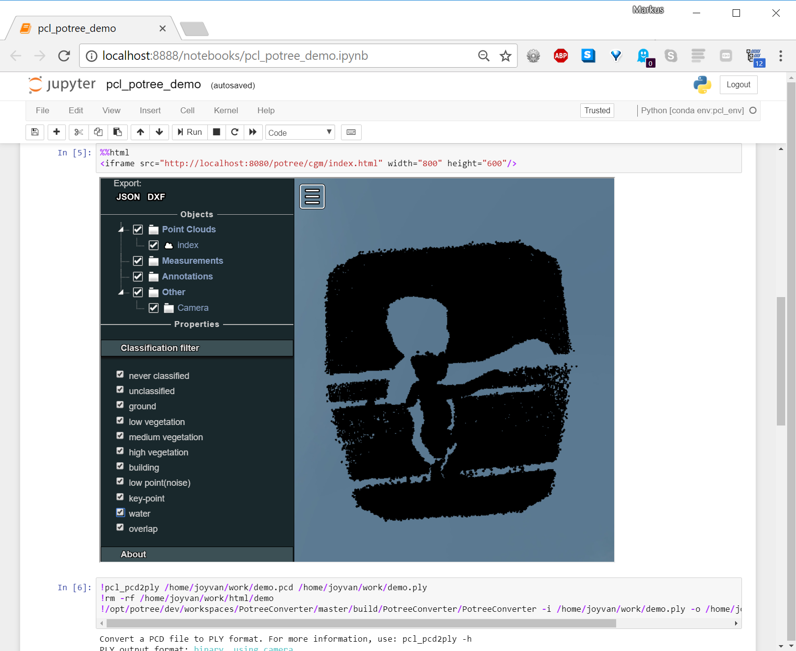

# Jupyter Notebook for 3d point cloud visualization
> pcl and potree for vtk, pcd and other formats

This lets you visualize and measure point clouds in 3d while using Jupyter Notebook 



## Installing / Getting started

A quick introduction of the minimal setup you need to get a hello world up &
running.

```shell
git clone git@github.com:mmatiaschek/pcl-potree-jupyter-notebook.git
cd pcl-potree-jupyter-notebook
docker-compose up
```

- from the docker-compose you get a link to Jupyter Notebook with some demos
- open pcl_potree_demo.ipynb
- to execute the iframe potree visualization your have to start apache2 as well

```shell
cd pcl-potree-jupyter-notebook
docker exec -u root -ti pcl-potree-jupyter-notebook_pcl-potree-notebook_1 service apache2 start
```

TODO start apache in background from Dockerfile

## Licensing

This code is licensed under GPLv3
